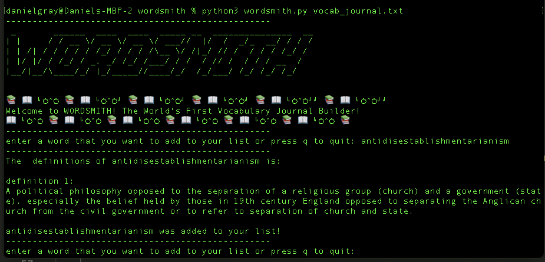

# Wordsmith 📚✨  
**The world's first vocabulary journal builder!** Wordsmith helps you expand your vocabulary while keeping an ever-growing journal of all the words you've learned, saved directly on disk.

This command-line program continuously prompts you for a word, fetches its definition from a dictionary API, saves it to a text file, and displays the definition live in your terminal. Learning has never been so seamless and fun!

---

## 🌟 Features
- **Live Definitions**: Instantly fetch and display the meaning of any word in your terminal.  
- **Persistent Vocabulary Journal**: Automatically save new words and their definitions to a text file on disk.  
- **Customizable Journal**: Use an existing journal or start fresh—your choice!

---

## Usage

pip install -r requirements.txt

python wordsmith.py vocab_journal.txt

### New File
Create a new vocabulary list by providing any filename.
### Existing File
Append new words/definitions to an existing file by passing in its name.

## 📒 Vocab Journal

### Flexible File Handling:
The `vocab_journal.txt` file can:
- Be an existing vocabulary journal you already maintain.
- Start as a completely blank file.
- Even be created dynamically if it doesn’t exist!

### Example:
If you’re starting fresh, just provide any name for your vocabulary list as the second command-line argument. The program will create the file for you and append new words/definitions each time you run it.

### Sample Journal:
I’ve included my recent vocabulary journal, inspired by reading *A Hitchhiker’s Guide to the Galaxy*. See how it works and get inspired!

## Coming Soon!!!
I want the program to output the audio pronunciation for every word the user puts in.

